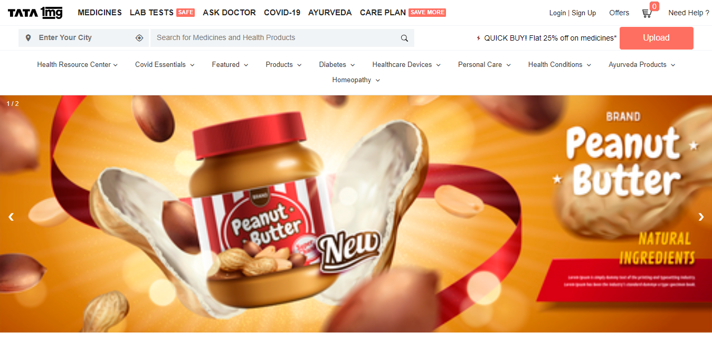
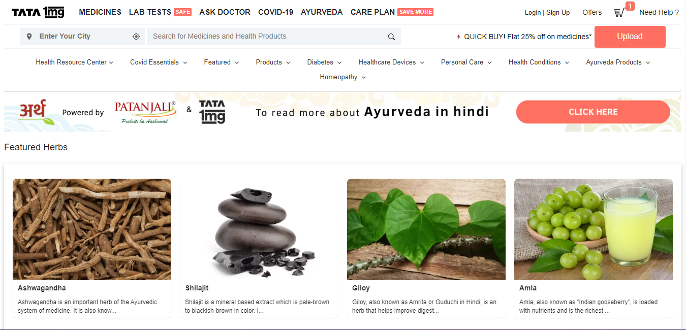
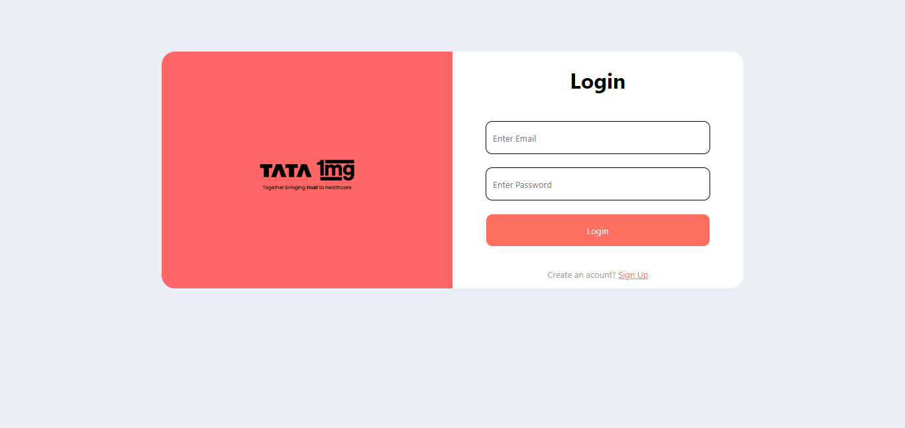
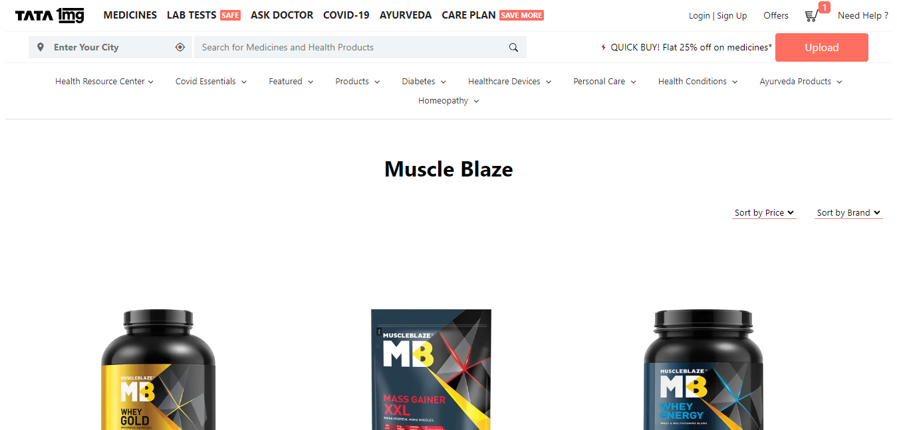
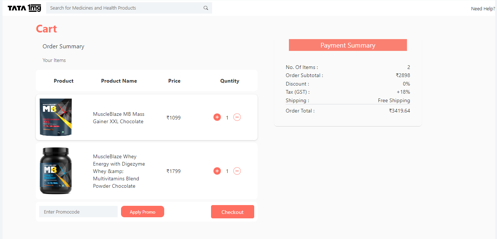

# Tata 1 mg

- Tata 1mg, previously 1mg, is a healthcare platform based in Gurugram, India. It provides services, including e-pharmacy, diagnostics, e-consultation and health content.
- We are a team of 6 from Unit-1, Masai School, batch FT-16, who worked on cloning the Tata 1mg website as part of our Unit-1 construct week. Our project demonstrates a basic flow of an e-commerce page, where a customer can view and filter products, add their product to a cart and place his or her order's.

## 🔗Deployed Link

[https://precious-biscotti-be61c5.netlify.app/feature.html](https://precious-biscotti-be61c5.netlify.app/feature.html)

# Tech Stack used

- HTML
- CSS
- JavaScript
- Bootstrap

# Presentation Video

[https://drive.google.com/file/d/1Va2ysLJWNovQOX7DDi-49CEr-HTd4jft/view?usp=sharing](https://drive.google.com/file/d/1Va2ysLJWNovQOX7DDi-49CEr-HTd4jft/view?usp=sharing)

# Features

- Add to cart functionality
- Login and Sign up functionality
- Addres functionality
- Payment functionality
- Otp functionality
- Products page with sorting functionality

## Homepage

## Ask Doctor page

## Lab Tests page

## Ayurveda page

## Login page

## Signup page

## Products page

## Cart page

## Address page

## Payment page

## OTP page

## Developers

- [@Affan Ahmad](https://github.com/AFFAN-AHMAD)
- [@Devesh Goyal ](https://github.com/DeveshGoyal26)
- [@Sampanna Chatterjee](https://github.com/Sam01-dev)
- [@Shubham Verma](https://github.com/S-hub1996)
- [@Paras Aghi](https://github.com/PARAS-AGHI)
- [@Chiranjit Behera](https://github.com/Chiranjit34)
